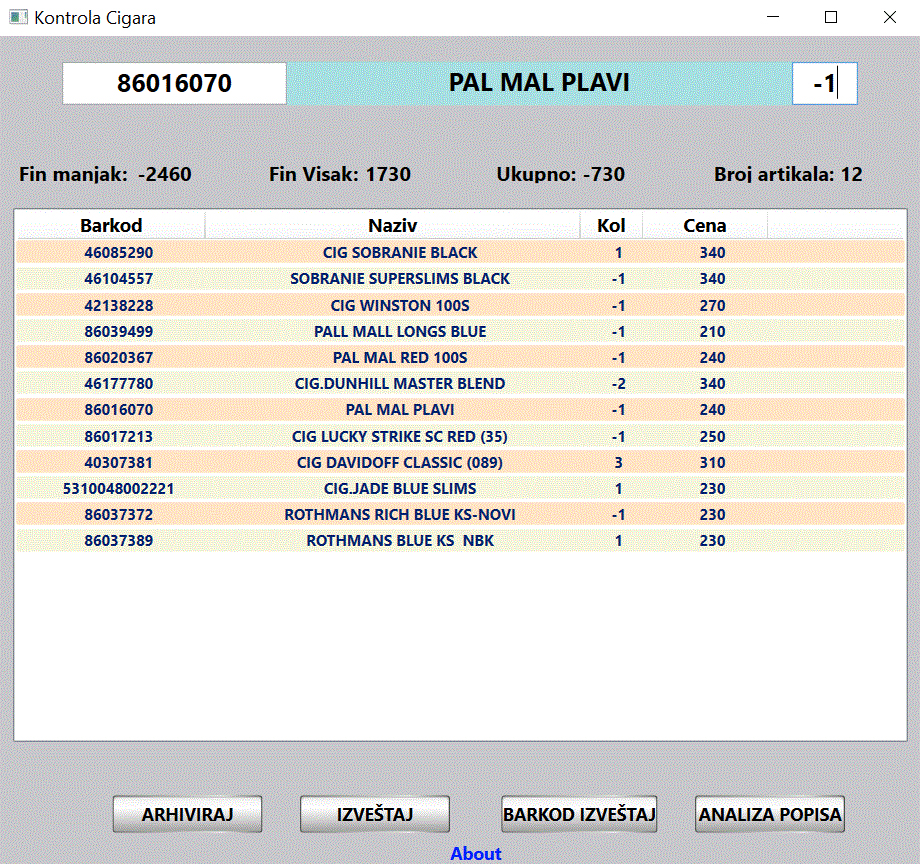
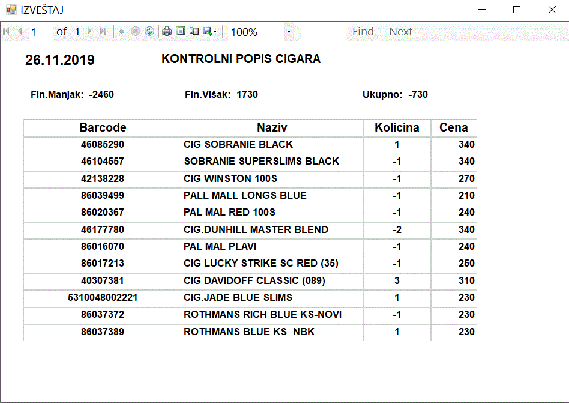
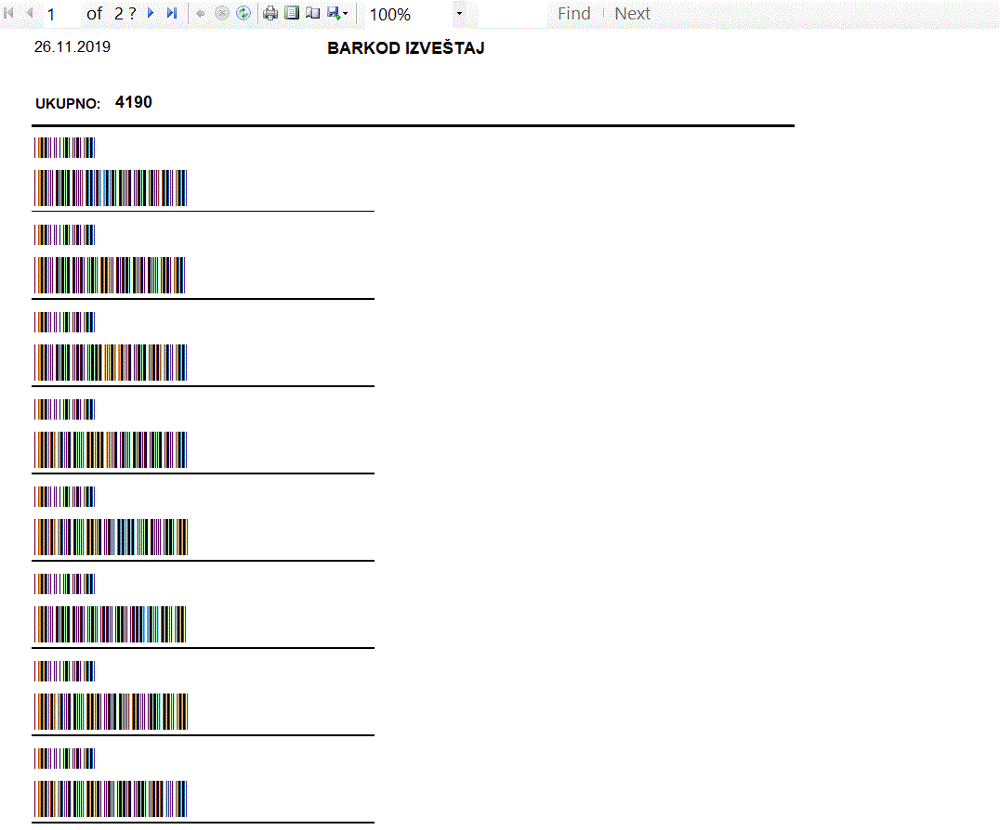
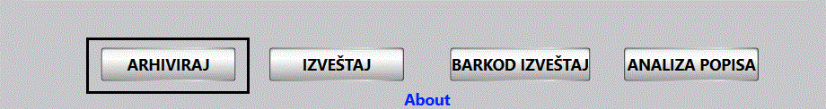
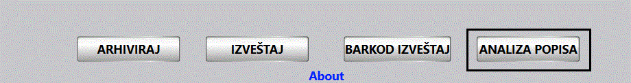
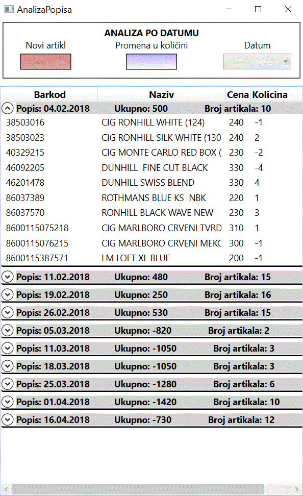
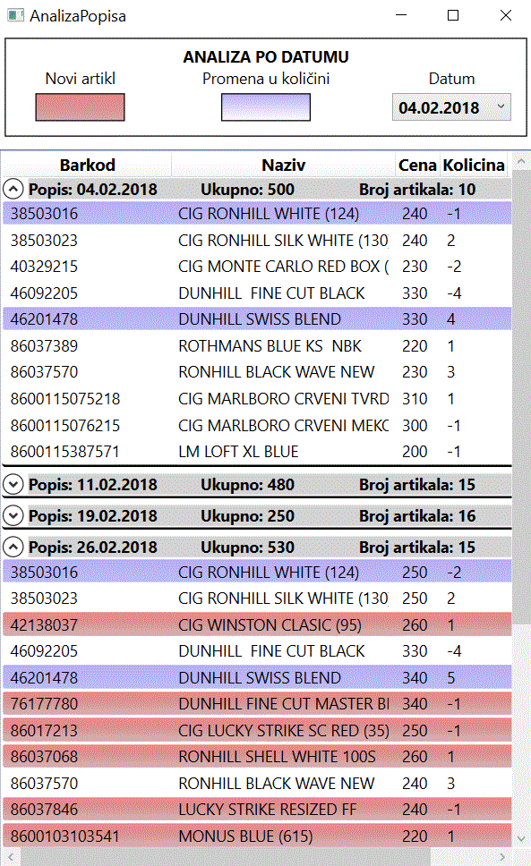

# Cigarette deficiency control application

### I developed this application to try and reduce the constant problem of cigarette deficiency. The application archives each control count of cigarettes and performs precise comparison off control count by date.

## Instructions
### The application uses a .xls Excel file as the database, copied to C:\Users\currentUser\Documents\PopisCigara directory.
### when a deficiency or surplus is found during the check count, use the barcode reader to read the barcode of the item and enter the deficiency or surplus number.

### After the controll count is finished you can print the report by clicking the "IZVEŠTAJ" button. 

### If we want to pay the current deficit, you can do so by clicking the "BARKOD IZVEŠTAJ" button, you only get barcodes. Using the barcode reader, you just go over the barcodes and the status of the list is recorded at the cash register. 

### Clicking the "ARHIVIRAJ" button saves the current count status in the csv file in the C:\Users\current user\Documents\PopisCigara\Popisi Directory.

### Clicking the "ANALIZA POPISA" button opens a window with an overview of all archived check counts.  

### This window shows all archived check counts, grouped by date, also shows the amount in cash as well as the total number of disputed items. 

### When a date is selected, the application scans all check counts and compares them with the date selected and records the differences. items that are not on the selected counting date are marked in red. Purple items are marked on the selected check count, but also on all remaining check counts and they differentiate in number of items.  

## Installing

### simply run the installshield wizard and follow the instructions.
